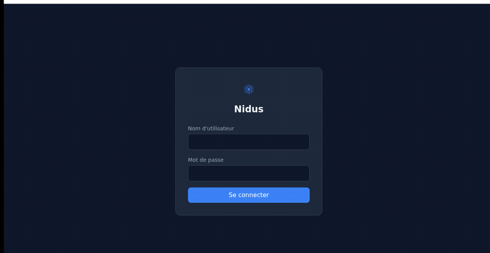
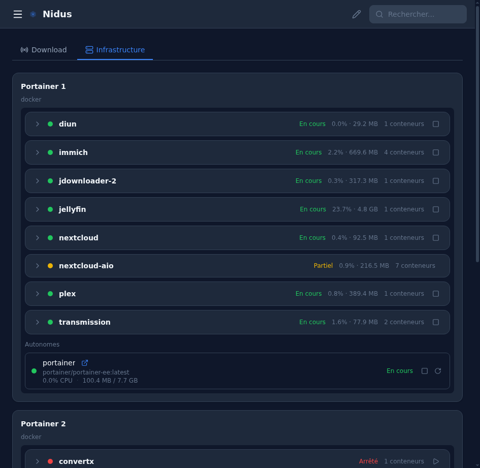
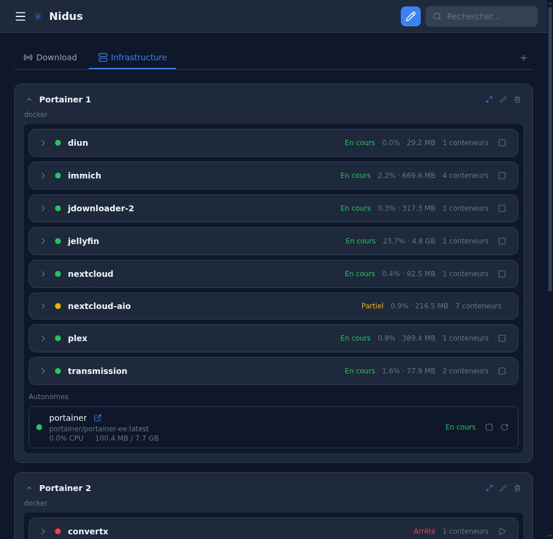
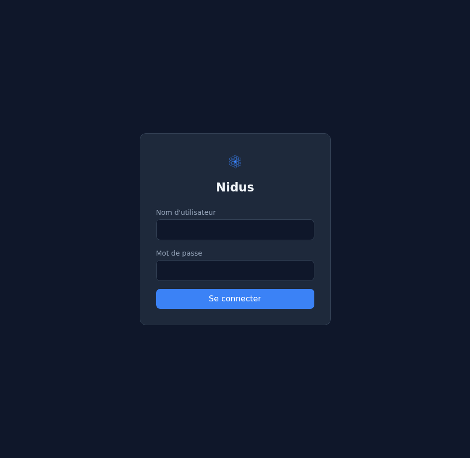
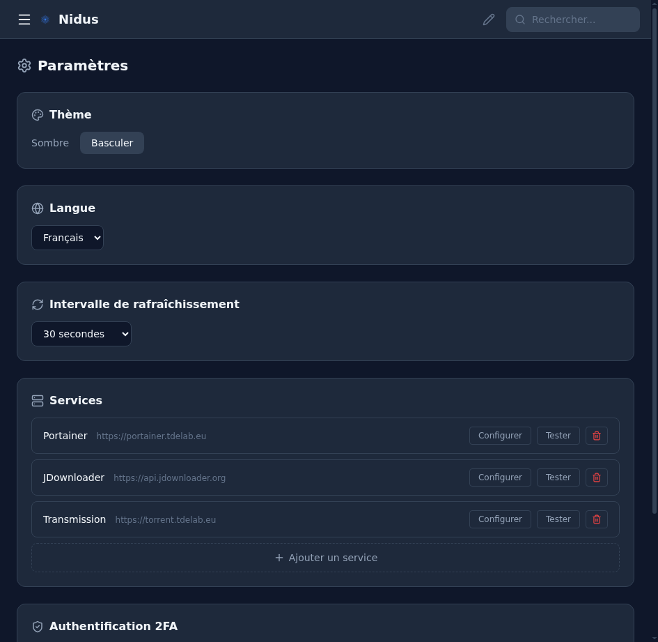
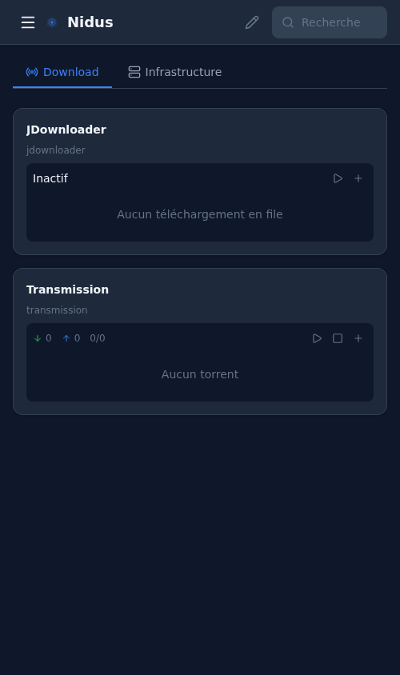

# Nidus

**A lightweight, self-hosted dashboard to monitor and manage your containers, VMs, and services from a single interface.**

[](./LICENSE)
[](https://github.com/tdebuilt/Nidus-Dashboard/actions/workflows/release.yml)
[](https://go.dev)
[](https://svelte.dev)
[](https://github.com/tdebuilt/Nidus-Dashboard/pkgs/container/nidus-dashboard)
[](./docs/TRANSLATING.md)

Most dashboard solutions are either too heavy on resources, read-only, or lack real control over your infrastructure. Nidus was born out of frustration — we needed something that could run comfortably on a low-spec server while still giving full visibility and control. Even with embedded camera streaming (go2rtc), the whole stack stays under 70 MB of RAM.

The name comes from Latin — *nidus* means "nest". A central hub where all your hosts, containers, and services come together.

### Key highlights

- **~30-70 MB RAM** — runs on anything, including a Raspberry Pi
- **Single binary or Docker container** — no external database, includes embedded go2rtc for camera streaming
- **Real control** — start, stop, restart, update containers and VMs directly
- **Extensible widget system** — add new integrations through a simple registry
- **Desktop app** — native installers for Linux, macOS, and Windows via Tauri

<p align="center">
  
</p>

<details>
<summary>Screenshots</summary>

| Dashboard | Infrastructure |
|:---:|:---:|
|  |  |

| Login | Settings |
|:---:|:---:|
|  |  |

| Edit Mode | Mobile |
|:---:|:---:|
|  |  |

</details>

---

## Why Nidus?

| Solution | What's missing |
|---|---|
| **Homarr** | Heavy on RAM (~600 MB+), reported memory leaks, Next.js stack |
| **Homepage** | Read-only — no container or VM control |
| **Heimdall** | Bookmarks only, no service integration |
| **Dashy / Flame** | No Docker or Proxmox management |
| **Portainer** | Excellent for Docker, but no unified view with Proxmox, Home Assistant, or other services |

Nidus fills the gap: a **fast, lightweight dashboard** with real container management, service integrations, and a customizable widget layout — all in a single Go binary.

## Features

### Dashboard & Layout
- **Custom categories** — Organize widgets into tabbed groups (Infrastructure, Media, etc.)
- **Resizable widgets** — 12-column grid layout with drag-and-drop positioning
- **Edit mode** — Lock/unlock the dashboard to prevent accidental changes
- **Dark / light theme** — Dark by default, toggle anytime
- **Responsive** — Desktop sidebar, mobile-friendly with burger menu
- **PWA** — Installable on mobile, works offline

### Service integrations
- **Docker via Portainer** — Stacks & containers: start/stop/restart/update, CPU & RAM stats per container
- **Proxmox** — VMs & LXCs: status, metrics, start/stop
- **Home Assistant** — Any entity as a widget with real-time actions via WebSocket
- **AdGuard Home** — DNS query stats, toggle filtering on/off
- **JDownloader** — Add links, manage download queue, cleanup finished downloads
- **Transmission** — Add torrents, pause/resume, monitor progress
- **Reolink cameras** — Live RTSP streams via embedded go2rtc (WebRTC)
- **App Links** — Custom bookmarks with automatic health checks

### Platform
- **Widget registry** — Extensible system to add new widgets with minimal code
- **i18n** — French & English built-in, extensible to other languages
- **Auth** — User/password with optional TOTP 2FA
- **Setup wizard** — Guided first-launch configuration
- **Config export/import** — Encrypted backup and restore (AES-256-GCM)
- **Tiny footprint** — ~30-70 MB RAM, single Docker container or standalone binary

## Architecture

```
┌──────────────────────────────────────────────────┐
│                 Nidus Container                   │
│  Go backend + Svelte frontend + SQLite + go2rtc  │
└───────────────────────┬──────────────────────────┘
                        │
     ┌──────────┬───────┼───────────┬──────────┐
     │          │       │           │          │
 Portainer   Proxmox  Services   Reolink    go2rtc
  API         API    (HA, AdGuard, cameras   (RTSP →
 (CE/EE)              JDL, Trans.)           WebRTC)
```

- **No agent** — connects to existing APIs only
- **Portainer API** for all Docker operations (not Docker API directly)
- **Embedded go2rtc** for camera streaming (RTSP to WebRTC)
- **Single container** deployed via Docker Compose
- **SQLite** for config, layout, auth — single file, zero setup

## Tech Stack

| Component | Technology | RAM |
|---|---|---|
| Backend | Go (Chi router) | ~20-30 MB |
| Frontend | Svelte (compiled → static, embedded in binary) | 0 MB server-side |
| Streaming | go2rtc (embedded) | ~30-40 MB |
| Database | SQLite | Included |
| Deployment | Docker Compose | Single container |

## Quick Start

```bash
docker run -d -p 3777:3777 -v nidus-data:/data ghcr.io/tdebuilt/nidus-dashboard:latest
```

Open [http://localhost:3777](http://localhost:3777) — the setup wizard will guide you through creating your account and connecting your services.

## Installation

### Docker Compose (recommended)

Create a `docker-compose.yml`:

```yaml
services:
  nidus:
    image: ghcr.io/tdebuilt/nidus-dashboard:latest
    container_name: nidus
    ports:
      - "3777:3777"
    volumes:
      - ./data:/data
    environment:
      - NIDUS_DB_PATH=/data/nidus.db
    restart: unless-stopped
```

Then run:

```bash
docker compose up -d
```

### Standalone binary

Download the binary for your platform from [GitHub Releases](https://github.com/tdebuilt/Nidus-Dashboard/releases):

| Platform | Binary |
|---|---|
| Linux (x64) | `nidus-x86_64-unknown-linux-gnu` |
| macOS (Intel) | `nidus-x86_64-apple-darwin` |
| macOS (Apple Silicon) | `nidus-aarch64-apple-darwin` |
| Windows | `nidus-x86_64-pc-windows-msvc.exe` |

```bash
chmod +x nidus-*
./nidus-x86_64-unknown-linux-gnu
# Open http://localhost:3777
```

### Desktop application

Native desktop installers are available from [GitHub Releases](https://github.com/tdebuilt/Nidus-Dashboard/releases):

| Platform | Format |
|---|---|
| Linux | `.deb`, `.AppImage` |
| macOS | `.dmg` |
| Windows | `.msi` |

The desktop app embeds the full Nidus stack (Go backend + Svelte frontend) via Tauri.

### Environment variables

| Variable | Default | Description |
|---|---|---|
| `NIDUS_PORT` | `3777` | HTTP server port |
| `NIDUS_BASE_URL` | `http://localhost:3777` | External URL (for reverse proxy setups) |
| `NIDUS_DB_PATH` | `./data/nidus.db` | Path to the SQLite database file |

Configuration can also be set via a `config.yaml` file. See [docs/DEPLOYMENT.md](./docs/DEPLOYMENT.md) for details.

### Ports & volumes

| Port | Description |
|---|---|
| `3777` | HTTP server (web UI + API) |
| `1984` | go2rtc API (internal, camera streaming) |
| `8554` | RTSP server (go2rtc) |
| `8555` | WebRTC (go2rtc) |

| Volume | Description |
|---|---|
| `/data` | SQLite database, config, encryption keys — **back this up** |

## Modules

| Module | Connection | Features |
|---|---|---|
| **Docker** | Portainer API (CE + EE) | Stacks & containers: start/stop/restart/update |
| **Proxmox** | Proxmox API (token auth) | VMs/LXCs: status, metrics, start/stop, updates |
| **Home Assistant** | HA REST + WebSocket API | Any entity as widget with actions |
| **AdGuard** | AdGuard Home API | Query stats, toggle filtering |
| **JDownloader** | MyJDownloader API | Add links, manage queue |
| **Transmission** | Transmission RPC API | Add torrents, pause/resume |
| **Reolink** | RTSP via embedded go2rtc | Live camera streams (WebRTC) |

All modules are configured via the UI during setup or in settings.

## Roadmap

See [ROADMAP.md](./ROADMAP.md) for a high-level overview and [ROADMAP_TASKS.md](./ROADMAP_TASKS.md) for the full detailed task breakdown.

**Completed:**
- [x] Go backend (Chi, SQLite, config, JWT auth, TOTP 2FA)
- [x] Svelte frontend (sidebar, 12-col grid, dark/light theme)
- [x] Categories & widget layout (drag-and-drop, resize, edit mode)
- [x] i18n (FR + EN)
- [x] Docker/Portainer integration with CPU/RAM stats
- [x] Proxmox integration (VMs/LXCs)
- [x] Home Assistant, AdGuard, JDownloader, Transmission modules
- [x] App links with health checks
- [x] Config export/import (encrypted)
- [x] CI/CD: Docker image on GHCR, multi-platform binaries, Tauri desktop apps

**Coming next:**
- [ ] Additional languages (community translations)
- [ ] Custom themes and accent colors
- [ ] New widgets: Uptime Kuma, Plex/Jellyfin, *arr stack, weather, RSS, system stats
- [ ] Multi-user with roles (admin/editor/viewer)
- [ ] Public API documentation (OpenAPI/Swagger)

## Documentation

- [Deployment Guide](./docs/DEPLOYMENT.md) — Docker, standalone, desktop, and CI/CD setup
- [Full Specification](./SPEC.md) — Detailed technical spec with all module definitions, UI design, and API details
- [Roadmap](./ROADMAP.md) — High-level project roadmap
- [Detailed Tasks](./ROADMAP_TASKS.md) — Full task breakdown (243 tasks across 6 phases)

## License

[MIT](./LICENSE)
