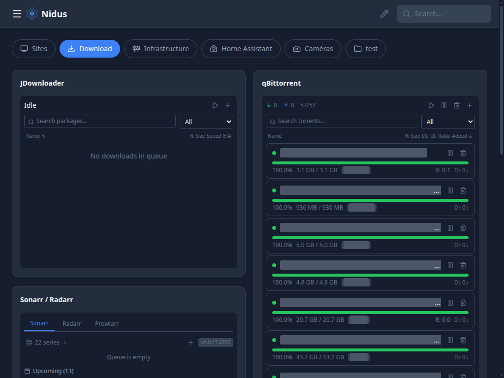
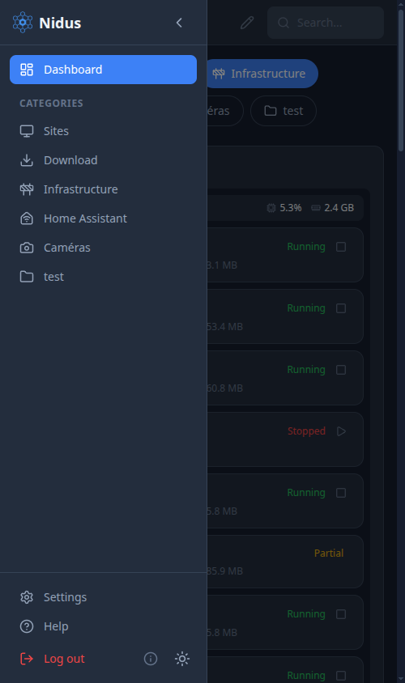

# Nidus

**A lightweight, self-hosted dashboard to monitor and manage your containers, VMs, and services from a single interface.**

[](./LICENSE)
[](https://github.com/tdebuilt/Nidus-Dashboard/actions/workflows/test.yml)
[](https://go.dev)
[](https://svelte.dev)
[](https://github.com/tdebuilt/Nidus-Dashboard/pkgs/container/nidus-dashboard)
[](./docs/TRANSLATING.md)

Most dashboard solutions are either too heavy on resources, read-only, or lack real control over your infrastructure. Nidus was born out of frustration — we needed something that could run comfortably on a low-spec server while still giving full visibility and control. Even with embedded camera streaming (go2rtc), the whole stack stays under 70 MB of RAM.

The name comes from Latin — *nidus* means "nest". A central hub where all your hosts, containers, and services come together.

### Key highlights

- **~30-70 MB RAM** — runs on any x86_64 machine
- **Single binary or Docker container** — no external database, includes embedded go2rtc for camera streaming
- **Real control** — start, stop, restart, update containers and VMs directly
- **19 widget types** — Docker, Proxmox, Home Assistant, media servers, cameras, and more
- **Desktop app** — native installers for Linux, macOS, and Windows via Tauri

<p align="center">
  
</p>

<details>
<summary>Screenshots</summary>

| Dashboard | Downloads |
|:---:|:---:|
|  |  |

| Edit Mode | Settings |
|:---:|:---:|
|  |  |

| Login | Mobile | Mobile Sidebar |
|:---:|:---:|:---:|
|  |  |  |

</details>

---

## Why Nidus?

| Solution | What's missing |
|---|---|
| **Homarr** | Heavy on RAM (~600 MB+), reported memory leaks, Next.js stack |
| **Homepage** | Read-only — no container or VM control |
| **Heimdall** | Bookmarks only, no service integration |
| **Dashy / Flame** | No Docker or Proxmox management |
| **Portainer** | Excellent for Docker, but no unified view with Proxmox, Home Assistant, or other services |

Nidus fills the gap: a **fast, lightweight dashboard** with real container management, service integrations, and a customizable widget layout — all in a single Go binary.

## Features

### Dashboard & Layout
- **Custom categories** — Organize widgets into tabbed groups (Infrastructure, Media, etc.)
- **Resizable widgets** — 12-column grid layout with drag-and-drop positioning
- **Edit mode** — Lock/unlock the dashboard to prevent accidental changes
- **Custom themes** — Dark, light, Nord, Dracula built-in + custom theme editor with accent color picker
- **Responsive** — Desktop sidebar, tablet, mobile, and TV layouts
- **PWA** — Installable on mobile, works offline
- **Kiosk mode** — Auto-rotate categories, full-screen, no UI chrome
- **Keyboard shortcuts** — Quick navigation (E = edit, 1-9 = categories, / = search, ? = help)

### Service integrations
- **Docker via Portainer** — Stacks & containers: start/stop/restart/update, CPU & RAM stats per container
- **Proxmox** — VMs & LXCs: status, metrics, start/stop
- **Home Assistant** — Any entity as a widget with real-time actions via WebSocket
- **AdGuard Home** — DNS query stats, toggle filtering on/off
- **Pi-hole** — DNS queries, blocked stats, toggle filtering
- **JDownloader** — Add links, manage download queue, cleanup finished downloads
- **Transmission** — Add torrents, pause/resume, monitor progress
- **qBittorrent** — Add torrents, pause/resume, search, sort and paginate
- **Plex / Jellyfin** — Active sessions, now playing, progress tracking
- **Sonarr / Radarr / Lidarr / Prowlarr** — Calendar, download queue, status
- **Uptime Kuma** — Monitor status, uptime percentage, latency
- **Reolink cameras** — Live RTSP streams via embedded go2rtc (WebRTC)
- **Grafana** — Embed Grafana panels with dashboard and panel picker
- **App Links** — Custom bookmarks with automatic health checks and favicons

### Additional widgets
- **Weather** — Current conditions and 5-day forecast (OpenWeatherMap)
- **Calendar** — iCalendar/ICS feed with upcoming events
- **RSS** — Aggregate multiple feeds into a single widget
- **System stats** — Host CPU, RAM, disk usage, uptime
- **Finance** — Stock ticker and market data

### Platform
- **Widget registry** — Extensible system to add new widgets with minimal code
- **i18n** — 11 languages: English, French, Spanish, German, Portuguese, Italian, Dutch, Russian, Chinese, Japanese, Arabic (with RTL)
- **Multi-user with roles** — Admin, editor, and viewer roles with invitation system
- **Auth** — User/password with optional TOTP 2FA
- **Setup wizard** — Guided first-launch configuration
- **Config export/import** — Encrypted backup and restore (AES-256-GCM), YAML or JSON
- **Notifications** — Push alerts via Gotify, ntfy, or Apprise (container down, service unreachable)
- **Webhooks** — Incoming webhook endpoints with HMAC validation
- **API documentation** — OpenAPI/Swagger UI at `/api/docs/` (enable with `NIDUS_ENABLE_DOCS=true`)
- **Tiny footprint** — ~30-70 MB RAM, single Docker container or standalone binary

## Architecture

```
┌──────────────────────────────────────────────────┐
│                 Nidus Container                   │
│  Go backend + Svelte frontend + SQLite + go2rtc  │
└───────────────────────┬──────────────────────────┘
                        │
     ┌──────────┬───────┼───────────┬──────────┐
     │          │       │           │          │
 Portainer   Proxmox  Services   Reolink    go2rtc
  API         API    (HA, AdGuard, cameras   (RTSP →
 (CE/EE)              Pi-hole,              WebRTC)
                       *arr, Plex,
                       Jellyfin, etc.)
```

- **No agent** — connects to existing APIs only
- **Portainer API** for all Docker operations (not Docker API directly)
- **Embedded go2rtc** for camera streaming (RTSP to WebRTC)
- **Single container** deployed via Docker Compose
- **SQLite** for config, layout, auth — single file, zero setup

## Tech Stack

| Component | Technology | RAM |
|---|---|---|
| Backend | Go (Chi router) | ~20-30 MB |
| Frontend | Svelte 5 (compiled → static, embedded in binary) | 0 MB server-side |
| Streaming | go2rtc (embedded) | ~30-40 MB |
| Database | SQLite | Included |
| Deployment | Docker Compose | Single container |

## Quick Start

```bash
docker run -d -p 3777:3777 -v nidus-data:/data ghcr.io/tdebuilt/nidus-dashboard:latest
```

Open [http://localhost:3777](http://localhost:3777) — the setup wizard will guide you through creating your account and connecting your services.

## Installation

### Docker Compose (recommended)

Create a `docker-compose.yml`:

```yaml
services:
  nidus:
    image: ghcr.io/tdebuilt/nidus-dashboard:latest
    container_name: nidus
    ports:
      - "3777:3777"
    volumes:
      - ./data:/data
    environment:
      - NIDUS_DB_PATH=/data/nidus.db
    restart: unless-stopped
```

Then run:

```bash
docker compose up -d
```

### Standalone binary

Download the binary for your platform from [GitHub Releases](https://github.com/tdebuilt/Nidus-Dashboard/releases):

| Platform | Binary |
|---|---|
| Linux (x64) | `nidus-x86_64-unknown-linux-gnu` |
| macOS (Intel) | `nidus-x86_64-apple-darwin` |
| macOS (Apple Silicon) | `nidus-aarch64-apple-darwin` |
| Windows | `nidus-x86_64-pc-windows-msvc.exe` |

```bash
chmod +x nidus-*
./nidus-x86_64-unknown-linux-gnu
# Open http://localhost:3777
```

### Desktop application

Native desktop installers are available from [GitHub Releases](https://github.com/tdebuilt/Nidus-Dashboard/releases):

| Platform | Format |
|---|---|
| Linux | `.deb`, `.AppImage` |
| macOS | `.dmg` |
| Windows | `.msi` |

The desktop app embeds the full Nidus stack (Go backend + Svelte frontend) via Tauri.

### Environment variables

| Variable | Default | Description |
|---|---|---|
| `NIDUS_PORT` | `3777` | HTTP server port |
| `NIDUS_BASE_URL` | `http://localhost:3777` | External URL (for reverse proxy setups) |
| `NIDUS_DB_PATH` | `./data/nidus.db` | Path to the SQLite database file |
| `NIDUS_ENABLE_DOCS` | `false` | Enable Swagger UI at `/api/docs/` |

Configuration can also be set via a `config.yaml` file. See [docs/DEPLOYMENT.md](./docs/DEPLOYMENT.md) for details.

### Ports & volumes

| Port | Description |
|---|---|
| `3777` | HTTP server (web UI + API + Swagger) |
| `1984` | go2rtc API (camera streaming, managed internally) |

| Volume | Description |
|---|---|
| `/data` | SQLite database, config, encryption keys — **back this up** |

## Modules

| Module | Connection | Features |
|---|---|---|
| **Docker** | Portainer API (CE + EE) | Stacks & containers: start/stop/restart/update, CPU & RAM stats |
| **Proxmox** | Proxmox API (token auth) | VMs/LXCs: status, metrics, start/stop |
| **Home Assistant** | HA REST + WebSocket API | Any entity as widget with real-time actions |
| **AdGuard** | AdGuard Home API | Query stats, toggle filtering |
| **Pi-hole** | Pi-hole API | DNS stats, blocked queries, toggle filtering |
| **JDownloader** | MyJDownloader API | Add links, manage queue |
| **Transmission** | Transmission RPC API | Add torrents, pause/resume |
| **qBittorrent** | qBittorrent Web API | Add torrents, pause/resume, search, sort, paginate |
| **Plex** | Plex API | Active sessions, now playing |
| **Jellyfin** | Jellyfin API | Active sessions, now playing |
| **Sonarr / Radarr** | *arr API | Calendar, download queue, status |
| **Lidarr / Prowlarr** | *arr API | Music library, indexer status |
| **Uptime Kuma** | Uptime Kuma API | Monitor status, uptime %, latency |
| **Reolink** | RTSP via embedded go2rtc | Live camera streams (WebRTC) |
| **Grafana** | Grafana API | Embed panels, dashboard picker |
| **Weather** | OpenWeatherMap API | Current + 5-day forecast |
| **Calendar** | iCalendar (ICS) | Upcoming events from any ICS URL |
| **RSS** | RSS/Atom feeds | Aggregated article list |
| **System** | Linux /proc | Host CPU, RAM, disk, uptime |
| **Finance** | Market data API | Stock ticker, price tracking |

All modules are configured via the UI during setup or in settings.

## Roadmap

See [ROADMAP.md](./ROADMAP.md) for the full roadmap.

**Completed:**
- [x] Go backend (Chi, SQLite, config, JWT auth, TOTP 2FA)
- [x] Svelte frontend (sidebar, 12-col grid, custom themes)
- [x] Categories & widget layout (drag-and-drop, resize, edit mode)
- [x] i18n (11 languages including RTL)
- [x] Docker/Portainer integration with CPU/RAM stats
- [x] Proxmox integration (VMs/LXCs)
- [x] Home Assistant, AdGuard, Pi-hole, JDownloader, Transmission modules
- [x] Plex/Jellyfin, Sonarr/Radarr/Lidarr/Prowlarr, Uptime Kuma modules
- [x] Weather, Calendar, RSS, System stats, Finance widgets
- [x] Reolink cameras with embedded go2rtc streaming
- [x] Grafana panel embedding
- [x] App links with health checks and favicons
- [x] Multi-user with roles (admin/editor/viewer) and invitation system
- [x] Custom themes, accent colors, and custom CSS
- [x] Notifications (Gotify, ntfy, Apprise) and webhooks
- [x] Kiosk mode and keyboard shortcuts
- [x] Config export/import (encrypted YAML/JSON)
- [x] API documentation (OpenAPI/Swagger)
- [x] CI/CD: Docker image on GHCR, multi-platform binaries, Tauri desktop apps
- [x] E2E testing with Playwright

**Coming next:**
- [ ] Plugin system — load third-party widgets from a `plugins/` directory

## Development

```bash
make dev                # Run Go backend + Svelte dev server (hot reload)
make test               # Run all tests (backend + frontend)
make test-backend       # Go tests only
make test-frontend      # Vitest only
make test-e2e           # Playwright E2E tests (builds app first)
make test-e2e-headed    # E2E tests with visible browser
make lint               # Run all linters (Go + frontend)
make build              # Production build (Svelte → embed → Go binary)
make docker             # Build and run via Docker Compose
make desktop-dev        # Run Tauri desktop app in dev mode
make setup              # Configure git hooks
```

## Documentation

- [Deployment Guide](./docs/DEPLOYMENT.md) — Docker, standalone, desktop, and CI/CD setup
- [Configuration Reference](./docs/CONFIG_YAML.md) — YAML config format and options
- [API Examples](./docs/EXAMPLES.md) — curl examples for common API calls
- [Translation Guide](./docs/TRANSLATING.md) — How to add a new language
- [Full Specification](./SPEC.md) — Detailed technical spec with all module definitions
- [Roadmap](./ROADMAP.md) — Planned and completed features

## License

[MIT](./LICENSE)
